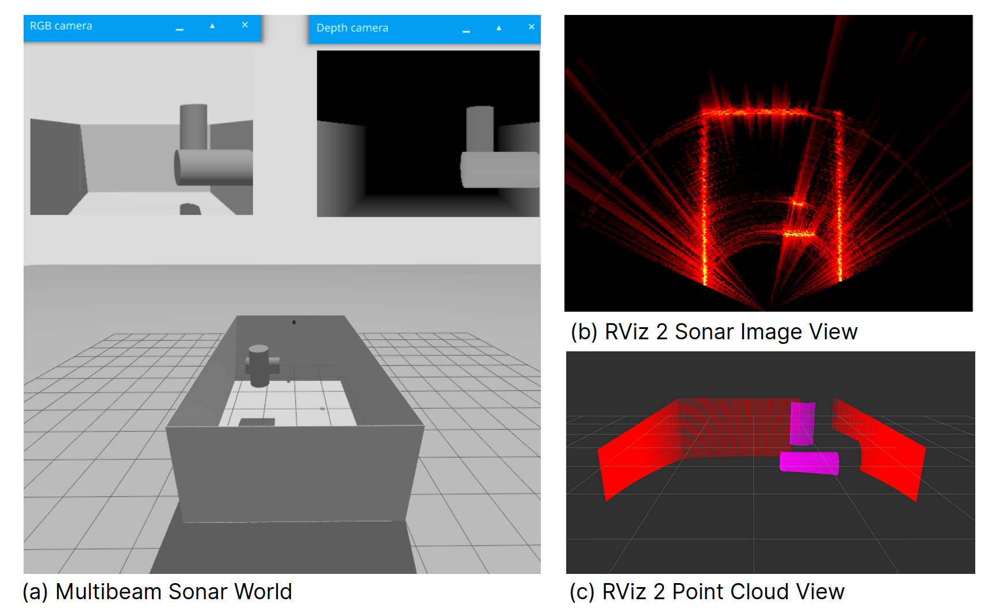
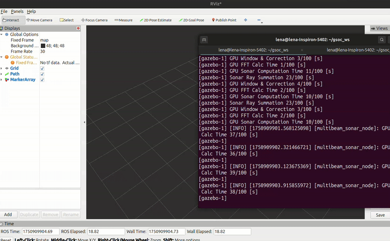

# DAVE Multibeam Sonar Plugin

The DAVE multibeam sonar plugin, adapted for ROS 2 Jazzy and Gazebo Harmonic, uses a ray-based multibeam model that simulates phase, reverberation, and speckle noise through a point scattering approach. It generates realistic intensity-range (A-plot) data while accounting for time and angular ambiguities as well as speckle noise.

**Key Features**

- Physical sonar beam/ray calculation with the point scattering model
    - Generating intensity-range (A-plot) raw sonar data
    - Publishes the data with UW APL’s sonar image msg format
- NVIDIA CUDA core GPU parallelization

Below is a diagram showing how the plugin is structured and how **CUDA** is utilized to perform the sonar calculations.

<p align="center">
  
</p>

**Original Research paper**

- Choi, W., Olson, D., Davis, D., Zhang,
M., Racson, A., Bingham, B. S., … & Herman, J. Physics-based
modelling and simulation of Multibeam Echosounder perception for
Autonomous Underwater Manipulation. Frontiers in Robotics and AI, 279. [10.3389/frobt.2021.706646](https://www.frontiersin.org/articles/10.3389/frobt.2021.706646)

**Original DAVE Wiki**

- DAVE Wiki: https://field-robotics-lab.github.io/dave.doc/contents/dave_sensors/Multibeam-Forward-Looking-Sonar/

## Getting started

The plugin uses **CUDA** to accelerate the sonar calculations.

To install the required system dependencies, follow the instructions below:

- ‣ : Native Local Installation Manual
- ‣ : Docker Installation Manual

The folder is divided into three parts: the **Demo**, the **Gazebo Plugin**, and the **Gazebo System**, which must be included in the `world` file for the plugin to function correctly.

```xml
dave_gz_multibeam_sonar/
├── multibeam_sonar -- Gazebo Plugin files (Sonar calculations)
├── multibeam_sonar_demo -- Demo files (launch, scripts, rviz)
├── multibeam_sonar_system -- Gazebo System files
└── README.md
```

## Running demos

Remember to run

```bash
source install/setup.bash
```

after using `colcon build` or when opening a new terminal session.

### 1. Launch example with `ros_gz_bridge` to translate Gazebo Point Cloud to ROS 2

Use the following command to run the multibeam sonar demo with point cloud and sonar image visualization:

```bash
ros2 launch dave_multibeam_sonar_demo multibeam_sonar_demo.launch.py
```

Both the point cloud and sonar image are available for visualization in **RViz2**. The default RViz file is configured to show the topic `/sensor/multibeam_sonar/point_cloud` and `/sensor/multibeam_sonar/sonar_image` .

<p align="center">
  
</p>

### 2. Launch example with `dave_sensor.launch.py`

Use the following command to run the multibeam sonar demo using the `dave_sensor.launch.py` :

```bash
ros2 launch dave_demos dave_sensor.launch.py namespace:=blueview_p900 world_name:=dave_multibeam_sonar paused:=false x:=4 z:=2.0 yaw:=3.14
```

To check the sonar image, you can open RViz2 and add a view to the sonar image topic in the displays panel ( Add → By topic → `/sensor/multibeam_sonar/sonar_image` → Image):

<p align="center">
  
</p>

## Creating your own sonar

An example sonar SDF file is located in `dave/models/dave_sensor_models/description` .

Inside your model tags, insert the sensor like this:

```xml
<!-- Multibeam Sonar sensor -->
<sensor name="multibeam_sonar" type="custom" gz:type="multibeam_sonar">
  <always_on>true</always_on>
  <update_rate>30.0</update_rate>
  <topic>/sensor/multibeam_sonar</topic>
  <visualize>true</visualize>

  <gz:multibeam_sonar>
    <ray degrees="false">
      <scan>
      <!-- Blueview p900 HFOV: 130 degrees -->
        <horizontal>
          <beams>512</beams>
          <min_angle>-1.13447</min_angle>
          <max_angle>1.13447</max_angle>
        </horizontal>
        <vertical>
       <!-- Blueview p900 VFOV: 12 degrees -->
          <rays>300</rays>
          <min_angle>-0.10472</min_angle>
          <max_angle>0.10472</max_angle>
        </vertical>
      </scan>
      <range>
      <!-- min range is a collision range no need to change-->
        <min>0.1</min>
        <max>10.0</max>
      </range>
    </ray>
    ...
 </gz:multibeam_sonar>
</sensor>
```

The HFOV and VFOV parameters can be adjusted to match the specifications of the target sonar.

The `<spec>` block defines key sonar and plugin configuration parameters used in simulation.

**Sonar properties** include:

- `<verticalFOV>`: Vertical field of view of the sonar.
- `<sonarFreq>`: Operating frequency in Hz.
- `<bandwidth>`: Bandwidth around the sonar frequency.
- `<soundSpeed>`: Speed of sound in water (m/s).
- `<sourceLevel>`: Source level in dB re 1 μPa @ 1m.
- `<maxDistance>`: Maximum detectable range (meters).

**Plugin-specific settings**:

- `<raySkips>`: Number of rays to skip for faster computation.
- `<sensorGain>`: Gain applied to enhance visualization.
- `<writeLog>`: Enables logging of raw sonar data to CSV. When set to `true`, CSV files are generated in the simulation's working directory. The data can be visualized using the script `/scripts/plotdata.py`.
- `<debugFlag>`: Prints frame computation time to the console.
- `<writeFrameInterval>`: Interval (in frames) at which logs are written.

**ROS topics for output**:

- `<pointCloudTopicName>`: This parameter is only relevant when using `ros_gz_bridge` in the launch file to visualize the point cloud. The topic name must match the one specified in the corresponding `.launch.py` file:

    ```python
    bridge = Node(
        package="ros_gz_bridge",
        executable="parameter_bridge",
        arguments=[
            "/sensor/multibeam_sonar/point_cloud@sensor_msgs/msg/PointCloud2@gz.msgs.PointCloudPacked",
        ],
        output="screen",
    )
    # In this case, our <pointCloudTopicName> should be "point_cloud"
    ```

- `<sonarImageRawTopicName>`: Raw sonar image topic.
- `<sonarImageTopicName>`: Processed sonar image topic.
- `<frameName>`: Frame ID for the published data.

Example for `blueview_p900`:

```xml

  <spec>
    <!-- Sonar properties -->
    <verticalFOV>12</verticalFOV>
    <sonarFreq>900e3</sonarFreq>
    <bandwidth>29.9e3</bandwidth>
    <soundSpeed>1500</soundSpeed>
    <sourceLevel>220</sourceLevel>
    <maxDistance>10</maxDistance>
    <constantReflectivity>false</constantReflectivity>
    <raySkips>10</raySkips>
    <sensorGain>0.02</sensorGain>
    <plotScaler>10</plotScaler>
    <writeLog>true</writeLog>
    <debugFlag>true</debugFlag>
    <writeFrameInterval>5</writeFrameInterval>

    <!-- ROS publication topics -->
    <pointCloudTopicName>point_cloud</pointCloudTopicName>
    <sonarImageRawTopicName>sonar_image_raw</sonarImageRawTopicName>
    <sonarImageTopicName>sonar_image</sonarImageTopicName>
    <frameName>forward_sonar_optical_link</frameName>
  </spec>
```

## Creating your own world

To create your own world compatible with the sonar plugin, include the following plugins at the top of your world file:

```xml
<world name="default">
  ...
    <!-- Core Gazebo Systems -->
    <plugin filename="gz-sim-sensors-system"
            name="gz::sim::systems::Sensors">
      <render_engine>ogre2</render_engine>
    </plugin>

    <!-- Custom Multibeam Sonar System Plugin -->
    <plugin filename="multibeam_sonar_system"
            name="custom::MultibeamSonarSystem" />
</world>
```

## Using launch files

After creating the world and sonar file, it is possible to use the same `dave_sensor.launch.py` to run the simulation.

```bash
ros2 launch dave_demos dave_sensor.launch.py namespace:=<your_sonar_name> world_name:=<your_world_name> paused:=false x:=4 z:=2.0 yaw:=3.14
```

To create a new launch file, use the example located at `/multibeam_sonar_demo/launch/multibeam_sonar_demo.launch.py` and modify the parameters as needed, including any `ros_gz_bridge` configurations.